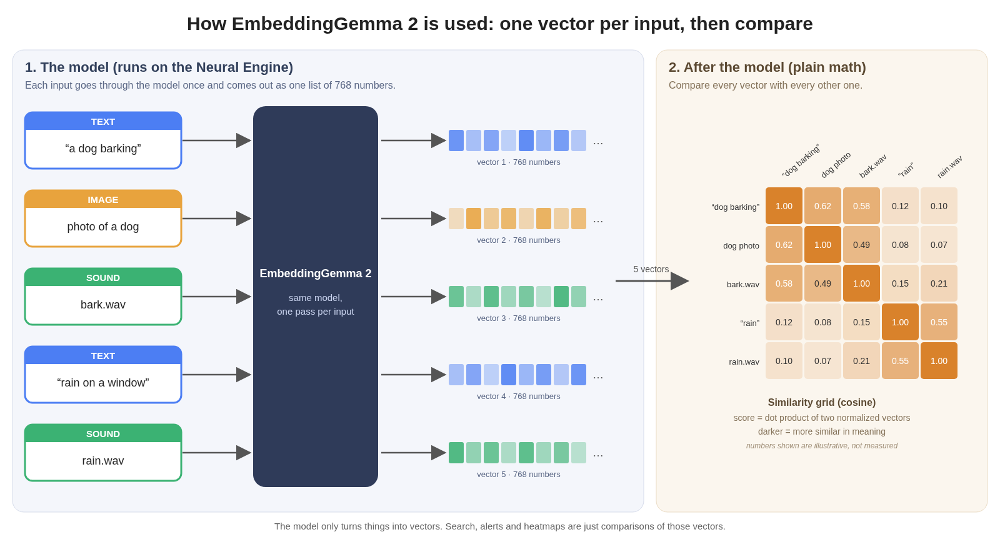

# anemll-embeddings

This project turns Google’s EmbeddingGemma 2 into Apple Core AI packages that run on your Mac’s Neural Engine. You can search photos, sounds, and text together. Everything stays on the Mac - there is no cloud API in the loop.

The Neural Engine is the dedicated chip on Apple Silicon for this kind of work. These packages are built so the hot path stays on that chip: no mid-graph hop to the GPU or CPU.

**Where that holds today:**

| Mac | macOS | Placement |
| --- | --- | --- |
| M4 Pro, M3 Ultra | 27.0 | All three towers fully on the Neural Engine (validated) |
| M5 | 27.2 | All three towers work and match the reference (cosine 0.99994-0.99997). Audio runs on the Neural Engine; vision and text currently run on the GPU (the macOS 27.2 ANE pre-check rejects them). See [M5 results](#m5-macos-272). |

Run `python scripts/warmup.py --require-ane` to check your own Mac; it exits non-zero unless every tower is fully on the Neural Engine.

## What is an embedding?

An embedding is a list of numbers that captures meaning. This model writes a list of 768 numbers for each photo, sound, or sentence. Things that mean the same thing land close together, even across types: a photo of a fox, a bark, and the words “a red fox” can match each other. Search then ranks by how close those lists are (cosine similarity on length-normalized vectors).



The model turns each input into one 768-number vector; similarity is computed afterwards by comparing vectors (grid values are illustrative).

One input (for example the phrase “white house”) always gives exactly one vector, regardless of length.

## What’s included

- Public Neural Engine packages on [Hugging Face](https://huggingface.co/anemll/anemll-embeddinggemma-2-ane), plus `scripts/download_models.py` (inference) and `scripts/warmup.py`
- Scripts that export EmbeddingGemma 2’s vision, audio, and text towers to Core AI `.aimodel` packages
- Host code that tokenizes text, runs those packages, and inserts image/audio tokens into the text model
- A local demo: search, a similarity heatmap, “search what I heard”, and camera alerts (see [Try the demo](#try-the-demo) and [demo/README.md](demo/README.md))
- Small test fixtures (prompts and reference vectors)
- An older text-only Core ML path (see [below](#older-text-only-core-ml-path))

## Folder map

| Path | What lives there |
| --- | --- |
| `model/` | Export / convert EmbeddingGemma 2 to Core AI / ANE: wrappers, ANE graph patches, specialize and inspect tools, parity and cosine checks |
| `api/` | Importable Python runtime: `from api import Embedder, cosine` - see [api/README.md](api/README.md) |
| `scripts/` | Inference download (`download_models.py`), export download (`download_export_assets.py`), HF `host/` staging (`prepare_hf_host_folder.py`), and warmup - see [scripts/README.md](scripts/README.md) |
| `hf/` | Hub card + `towers.yaml` + `host/SOURCE.md` to upload to [anemll/anemll-embeddinggemma-2-ane](https://huggingface.co/anemll/anemll-embeddinggemma-2-ane) |
| `samples/` | Small runnable examples plus corpus / alert fetch scripts and manifests (no large binaries in git) |
| `demo/` | FastAPI showcase server and static pages only (imports `api`) |
| `docs/` | How it works, historical plan, diagrams |
| `tests/` | Unit and API tests |

**Model weights are not in this git repo.** The converted Neural Engine packages and the slim `host/` folder (tokenizer, processor, extracted embed table) live on Hugging Face at [anemll/anemll-embeddinggemma-2-ane](https://huggingface.co/anemll/anemll-embeddinggemma-2-ane) (commit `1cbb580a392f2d4f57924dbc58fd77cc4351c1b7`). Inference is one download from that repo. If `host/` is missing on the pin, `scripts/download_models.py` falls back to [google/embeddinggemma-2](https://huggingface.co/google/embeddinggemma-2) at `914f7f89142e33e77833254d9c9b90c3cef7303b` (still not the full 1.49 GB `model.safetensors`). Re-export uses that full checkpoint. Both are Apache-2.0 under Google’s terms, not MIT.

## Requirements

- An Apple Silicon Mac running macOS 27. Fully-ANE placement is validated on **M4 Pro and M3 Ultra, macOS 27.0**. On M5 / macOS 27.2 all three towers work too, with vision and text on the GPU (see the table above).
- A host Python 3.11 or newer (tested: 3.11 and 3.12) for this repo: `pip install -e ".[runtime]"` installs `torch` 2.14, `torchvision` 0.29, and `transformers` 5.19. Exact tested versions are in [`constraints.txt`](constraints.txt). `sentence-transformers` 6.1 is only needed for the reference model, fixtures, and export (`.[reference]`).
- A **second** Python that can `import coreai.runtime` (Python 3.13 with `coreai-core` 1.0.0b2), found through `ANEMLL_COREAI_PYTHON` or the default locations. See [Core AI runtime](#core-ai-runtime).
- The public ANE packages at [anemll/anemll-embeddinggemma-2-ane](https://huggingface.co/anemll/anemll-embeddinggemma-2-ane), plus the slim Google host files (tokenizer / processor / 256 MiB embed table). The full ~740M checkpoint is only for re-export.

## Core AI runtime

The `.aimodel` packages run in a small resident worker under a separate interpreter that has Apple's `coreai-core` runtime. The host venv (torch, transformers) never imports it. For inference that interpreter only needs `coreai-core` and `numpy`:

```sh
python3.13 -m venv ~/.anemll-embeddings/coreai-venv
~/.anemll-embeddings/coreai-venv/bin/python -m pip install "coreai-core==1.0.0b2" numpy
~/.anemll-embeddings/coreai-venv/bin/python -c "import coreai.runtime; print('ok')"
```

(`uv venv --python 3.13 …` works too, but a `uv` venv has no `pip`; use `uv pip install --python ~/.anemll-embeddings/coreai-venv/bin/python …`.)

The runtime looks for that interpreter in this order and stops with setup instructions if none exists:

1. `--coreai-python PATH` / `Embedder(coreai_python=...)`
2. `$ANEMLL_COREAI_PYTHON` (must exist if set; a typo is an error, not a silent fallback)
3. `~/.anemll-embeddings/coreai-venv/bin/python` (the setup above; `$ANEMLL_EMBEDDINGS_HOME` moves it)
4. `anemll-forge/coreai/.venv/bin/python` in a checkout next to this repo, then `~/anemll-forge/coreai/.venv/bin/python`

Re-exporting the packages (`model/export_coreai_towers.py`) needs the fuller authoring stack instead: the `coreai/.venv` from [Anemll/anemll-forge](https://github.com/Anemll/anemll-forge) with `coreai-core` 1.0.0b2, `coreai-torch` 0.4.2, `coreai-opt` 0.2.1, and `torch` 2.11 on Python 3.13. Point `ANEMLL_COREAI_PYTHON` at it for export.

## Quick start

Fully on the Neural Engine on **M4 Pro / M3 Ultra, macOS 27.0**. On **M5 / macOS 27.2** all three towers work and match the reference; vision and text currently run on the GPU (see the table at the top).

1. **Install** the host side (in a virtualenv, Python 3.12 tested) and the [Core AI runtime](#core-ai-runtime):

   ```sh
   python -m pip install -e ".[runtime,demo]" -c constraints.txt
   # add ,reference for the Sentence-Transformers reference model / fixtures / export

   python3.13 -m venv ~/.anemll-embeddings/coreai-venv
   ~/.anemll-embeddings/coreai-venv/bin/python -m pip install "coreai-core==1.0.0b2" numpy
   ```

2. **Download** the public ANE packages and the slim host files from **one** Hugging Face repo (`anemll/anemll-embeddinggemma-2-ane`, including `host/`). This is the inference script only - it does **not** pull `model.safetensors` (1.49 GB). If `host/` is missing on the pin, it falls back to Google’s slim files. No Hugging Face login or token. The script needs `huggingface_hub`, which `pip install -e .` (or `.[demo]`) already installs. Full flag list and examples: [scripts/README.md](scripts/README.md).

   ```sh
   python scripts/download_models.py
   # or: ./scripts/download_models.sh
   # custom dest: python scripts/download_models.py --dest /path/to/fast/disk/anemll-embeddings
   ```

   **What gets downloaded** (about **1.49 GB** on disk):

   | What | Source | Size |
   | --- | --- | --- |
   | ANE towers (`vision_s280`, `audio_s280`, `text_embeds_s320`) | [anemll/anemll-embeddinggemma-2-ane](https://huggingface.co/anemll/anemll-embeddinggemma-2-ane) `@ 1cbb580a392f2d4f57924dbc58fd77cc4351c1b7` | **~1.19 GB** (vision 307 MB, audio 589 MB, text_embeds 291 MB) |
   | Host tokenizer / processor / configs | same repo, `host/` (fallback: [google/embeddinggemma-2](https://huggingface.co/google/embeddinggemma-2) `@ 914f7f89142e33e77833254d9c9b90c3cef7303b`) | **~37 MB** (`tokenizer.json` 32.2 MB, `tokenizer.model` 4.7 MB, plus `config.json`, processor / preprocessor configs, tokenizer config, chat template) |
   | Embed table `embed_tokens.safetensors` | same repo, `host/` (extracted from Google’s `model.safetensors`; not a full-weights download) | **256 MiB** (268,435,456 bytes, BF16 `[262144, 512]`, plus Gemma `sqrt(512)` scale) |
   | Package descriptor `config.json` | same repo, root (towers, shapes, `host/` paths; not a transformers config) | **~3 KB** |

   On-disk layout under `~/.anemll-embeddings` (default `--dest`; or `$ANEMLL_EMBEDDINGS_HOME`):

   ```
   ~/.anemll-embeddings/
     ane/
       config.json                     # package descriptor (root config.json on the Hub)
       vision_s280/vision_s280.aimodel/
       audio_s280/audio_s280.aimodel/
       text_embeds_s320/text_embeds_s320.aimodel/
     embeddinggemma-2/                 # slim host (from ane/host/ or Google fallback)
     artifacts/coreai/
       vision_s280.aimodel -> …/ane/vision_s280/vision_s280.aimodel
       audio_s280.aimodel -> …/ane/audio_s280/audio_s280.aimodel
       text_embeds_s320.aimodel -> …/ane/text_embeds_s320/text_embeds_s320.aimodel
   ```

   `api.Embedder`, the samples, `warmup.py`, and the demo use this default layout **without any exports**: when `ANEMLL_EMBEDDINGS_ARTIFACTS` / `ANEMLL_EMBEDDINGS_MODEL` are unset they read `~/.anemll-embeddings/artifacts` and `~/.anemll-embeddings/embeddinggemma-2` (or the same under `$ANEMLL_EMBEDDINGS_HOME`). The host side loads `embed_tokens.safetensors` when present, falling back to a full checkpoint if you already have one. If you used `--dest` or keep the Core AI interpreter somewhere else, put the printed exports (shell-quoted) in `~/.zshrc` or a file you `source`:

   ```sh
   # example output of scripts/download_models.py
   export ANEMLL_EMBEDDINGS_ARTIFACTS=/Users/you/.anemll-embeddings/artifacts
   export ANEMLL_EMBEDDINGS_MODEL=/Users/you/.anemll-embeddings/embeddinggemma-2
   export ANEMLL_COREAI_PYTHON=/Users/you/.anemll-embeddings/coreai-venv/bin/python
   ```

   Every fresh download is checked against SHA-256 digests tracked in this repo (`scripts/download_common.py`: tower `main.mlirb`, the root `config.json`, and every `host/` file) before it is marked complete. `--verify` re-checks files already on disk.

   | Flag | Default | Meaning |
   | --- | --- | --- |
   | `--dest PATH` | `~/.anemll-embeddings` | Parent directory (`ANEMLL_EMBEDDINGS_HOME` overrides the default) |
   | `--force` | off | Re-download even if the pinned revision is already on disk. Otherwise the script skips. Revisions are pinned in `scripts/download_common.py` (`ANE_REVISION=1cbb580a392f2d4f57924dbc58fd77cc4351c1b7`, overridable with `ANEMLL_ANE_REVISION`); there is no `--revision` flag. |
   | `--verify` | off | Re-hash files already on disk against the pinned digests |
   | `--coreai-python PATH` | `$ANEMLL_COREAI_PYTHON`, then the [default locations](#core-ai-runtime) | Value printed for `ANEMLL_COREAI_PYTHON` |

3. **Warm up** once on this Mac. There is **no** per-hardware compile to ship: Core AI specializes each tower for the local chip on first load and caches it (`$CFFIXED_USER_HOME/Library/Caches/coreai-cache`, or `~/Library/Caches/coreai-cache`). Cold first load is slow; later (warm) loads are fast.

   ```sh
   python scripts/warmup.py                 # report placement
   python scripts/warmup.py --require-ane   # exit 3 unless every tower is fully on the ANE
   ```

   ```
   # cold first load (M3 Ultra / macOS 27.0) - compile + cache, ~111 s
   tower                  on ANE                load_ms   first_run_ms
   vision_s280            yes                   58000.0            -
   audio_s280             yes                   16000.0            -
   text_embeds_s320       yes                   36000.0            -
   overall_placement=fullyOnANE  wall_ms=111000.0
   ```

   ```
   # warm load (M3 Ultra / macOS 27.0) - cache hit, load ~0.06–0.1 s per tower
   tower                  on ANE                load_ms   first_run_ms
   vision_s280            yes                      80.0          360.0
   audio_s280             yes                      80.0           25.0
   text_embeds_s320       yes                      80.0           42.0
   overall_placement=fullyOnANE
   ```

   M4 Pro / macOS 27.0 warm first-run p50 is in [Results](#results) (vision 337 ms, audio 10.8 ms, text 34.8 ms). M3 Ultra matches M4 embeddings (cosine 1.000000 / 0.999995) and also runs fully on the ANE.

   **Troubleshooting**

   - A **cold** first warmup of ~111 s on M3 Ultra is normal (compile + write the cache). A **warm** load is ~0.06–0.1 s per tower.
   - If warmup dies while loading, the Core AI cache may be unwritable or a broken symlink (`~/Library/Caches/coreai-cache`). Fix that path, or redirect Core AI's home: `python scripts/warmup.py --coreai-home /path/to/writable/home` (same as `export CFFIXED_USER_HOME=…`; the cache becomes `<home>/Library/Caches/coreai-cache`). Core AI has no free-form cache path, so `--cache-dir` only accepts a path ending in `Library/Caches/coreai-cache` and rejects anything else. Set `CFFIXED_USER_HOME` for later runs too (samples, demo) so they reuse that cache.
   - "no Core AI Python found" / "cannot import coreai.runtime": set up the [Core AI runtime](#core-ai-runtime) or set `ANEMLL_COREAI_PYTHON`.
   - On macOS 27.2 / M5, vision and text report `no (GPU)`. They work and match the reference; they currently run on the GPU because the macOS 27.2 ANE pre-check rejects them. Audio runs on the ANE. `--require-ane` exits 3 there because it requires every tower on the ANE.
   - Rerunning `download_models.py` or `warmup.py` is safe. Download skips files that already match the pinned revision.
   - To force a recompile: `rm -rf ~/Library/Caches/coreai-cache` then run `python scripts/warmup.py` again.

4. **Run a sample or the demo:**

   ```sh
   python samples/embed_sentence.py "a red fox"
   python -m demo.server --backend coreai --port 8766            # this Mac only (127.0.0.1)
   python -m demo.server --backend coreai --host 0.0.0.0 --port 8766   # LAN testing, see below
   ```

## Re-export the packages yourself

Optional. Everyday inference does **not** need this - use `scripts/download_models.py` above.

```sh
python scripts/download_export_assets.py
# copy the printed export lines, then:
python model/export_coreai_towers.py \
  --tower vision --tower audio --tower text --tower text_embeds
```

**What gets downloaded** (about **1.53 GB** on disk):

| What | Source | Size |
| --- | --- | --- |
| Full Google checkpoint (conversion weights) | [google/embeddinggemma-2](https://huggingface.co/google/embeddinggemma-2) `@ 914f7f89142e33e77833254d9c9b90c3cef7303b` | **~1.53 GB** (`model.safetensors` 1.49 GB / 1,488,915,288 bytes, plus tokenizer / processor / configs) |

The script writes `~/.anemll-embeddings/embeddinggemma-2-full` (separate from the slim inference dir) and prints the env `model/export_coreai_towers.py` needs:

```sh
# example output of scripts/download_export_assets.py
export ANEMLL_EMBEDDINGS_ARTIFACTS=/Users/you/.anemll-embeddings/artifacts
export ANEMLL_EMBEDDINGS_MODEL=/Users/you/.anemll-embeddings/embeddinggemma-2-full
export ANEMLL_COREAI_PYTHON=/path/to/anemll-forge/coreai/.venv/bin/python
```

Conversion also needs `pip install -e ".[runtime,reference]"` and the forge authoring interpreter (see [Core AI runtime](#core-ai-runtime)). That writes `vision_s280.aimodel` (pixels → 280 × 512 tokens), `audio_s280.aimodel` (280 × 128 mel frames → 70 × 512 tokens), `text_s128.aimodel` (ids-only 768-d; not in the public HF pack), and `text_embeds_s320.aimodel` (looked-up tokens, including image/audio, → 768-d). This is not `forge.py convert`.

## Python usage

Copy-paste examples (text–text, image–text, audio–text, camera-alert threshold) live in **[api/README.md](api/README.md)**. Short version:

```python
from api import Embedder, cosine

embedder = Embedder(compute="ane")  # or Embedder(backend="mock") without Core AI
q = embedder.embed_text("a red fox")                 # shape (768,), L2 == 1
d = embedder.embed_text("a red fox in snow", role="document")
print(cosine(q, d))                                  # float in [-1, 1]
embedder.close()
```

`python -m pip install -e .` makes `from api import Embedder` work from any working directory. From a repo checkout, keep the repo root on `PYTHONPATH` (the samples do this). The demo pages call this same `Embedder`. When constructor arguments are omitted, `Embedder(compute="ane")` reads `ANEMLL_EMBEDDINGS_ARTIFACTS`, `ANEMLL_EMBEDDINGS_MODEL`, and `ANEMLL_COREAI_PYTHON`, then falls back to the `~/.anemll-embeddings` download layout and the [Core AI runtime](#core-ai-runtime) locations. It raises `CoreAIPythonNotFound` with setup steps when no Core AI interpreter exists.

The host path in `api/coreai_host.py` runs `vision_s280` / `audio_s280`, scatters those tokens into the text sequence, then runs `text_embeds_s320`. `model/parity_coreai_host.py` is the full loop. The older Sentence-Transformers wrapper still lives at `model/embed_wrapper.py` for export and fixture work.

Examples: `python samples/embed_sentence.py --backend mock`, `python samples/image_text_search.py --backend mock`, `python samples/sound_matching.py --backend mock`, `python samples/camera_alert_rule.py --backend mock`. The samples also take `--artifacts`, `--model`, and `--coreai-python`.

## Results

Measured on an **M4 Pro, macOS 27.0**. Cosine is the Neural Engine package versus the patched PyTorch model in FP32 on CPU. Inputs: the aurora fixture image, the `tone_a4` fixture clip, and a caption plus image tokens (269 tokens).

| Package | Placement | Cosine vs FP32 CPU | p50 |
| --- | --- | --- | --- |
| `vision_s280` | fully ANE, 1 region | 0.999954 (row min 0.99979) | 337 ms |
| `audio_s280` | fully ANE, 1 region | 0.999927 (25 valid rows, row min 0.99944) | 10.8 ms |
| `text_embeds_s320` | fully ANE, 1 region | 0.999963 | 34.8 ms |

Each tower is one ANE region: `mps.fullyPlacedOnANE` and `mps.noGPUActivity`, with no GPU or CPU regions and no ANE validation messages.

End-to-end `Embedder(compute="ane")` scores on the same M4 Pro (cosine between two embeddings, after warmup):

| Pair | Cosine |
| --- | --- |
| text `a red fox` vs `a red fox in the snow` | 0.901 |
| text `a red fox` vs `a delivery truck` | 0.694 |
| UPS photo vs `a brown UPS delivery truck` | 0.727 |
| UPS photo vs `a cat` | 0.513 |
| bark vs `a dog barking` | 0.721 |
| bark vs `a cat meowing` | 0.661 |

About **35 ms** per sentence, **380 ms** per photo, **50 ms** per sound.

### M5, macOS 27.2

Measured on an **Apple M5 (32 GB), macOS 27.2**, with the same tower packages. All three towers work and match the reference. Audio runs on the Neural Engine; vision and text currently run on the GPU because the macOS 27.2 ANE pre-check rejects them (`invalid MLIR-MPS program`). A fix that puts the text tower on the Neural Engine on macOS 27.2 is being investigated.

Fixtures matched the reference at cosine **0.99994-0.99997**. A cold first compile and warmup took **9.0 s**, and a warm load took **0.56 s**.

End-to-end `Embedder(compute="ane")` scores on the M5 (cosine between two embeddings, after warmup), next to the M4 Pro numbers above:

| Pair | M5 | M4 Pro |
| --- | --- | --- |
| text `a red fox` vs `a red fox in the snow` | 0.901 | 0.901 |
| text `a red fox` vs `a delivery truck` | 0.693 | 0.694 |
| UPS photo vs `a brown UPS delivery truck` | 0.726 | 0.727 |
| UPS photo vs `a cat` | 0.511 | 0.513 |
| bark vs `a dog barking` | 0.717 | 0.721 |
| bark vs `a cat meowing` | 0.652 | 0.661 |

About **32 ms** per sentence, **155 ms** per photo, **46 ms** per sound (warm).

## How it works

Deeper notes: [docs/HOW_IT_WORKS.md](docs/HOW_IT_WORKS.md). In short:

- The model is three towers (vision ~170M, audio ~300M, text ~270M). Each becomes its own package. The host stitches them; the compiled graphs stay simple.
- The Neural Engine wants 16-bit (fp16) math. The original PyTorch model forbids fp16 because it produces NaNs. Export still uses an fp16 graph (`cast16`), and rewrites RMSNorm / LayerNorm as `x / max|x|` before squaring so large activations (around 900) do not overflow.
- Attention and masks were rewritten so every op is legal on the Neural Engine: no fused attention with mismatched key/value shapes, no 1-bit masks, no `-inf` (that is NaN in fp16; we use `-1e4`), no `aten.unfold`, no 64-bit gathers. Those were the old GPU/CPU leftovers. They are gone on the M4 Pro packages above.

The original conversion plan is in [docs/PLAN.md](docs/PLAN.md) (historical).

## Limitations

- Fully-ANE placement is validated on M4 Pro and M3 Ultra running macOS 27.0.
- On M5 / macOS 27.2 all three towers work and match the reference (cosine 0.99994-0.99997). Audio runs on the Neural Engine; vision and text currently run on the GPU (the macOS 27.2 ANE pre-check rejects them with `invalid MLIR-MPS program`).
- Audio clips must produce at least one mel frame (about 9 ms at 16 kHz). Shorter clips error instead of returning a bad vector.
- There is no video package yet. `<|video|>` fixtures are skipped.
- Weights are not in git. Use `scripts/download_models.py` for inference (~1.49 GB). Use `scripts/download_export_assets.py` only if you will re-convert. Check the [EmbeddingGemma 2](https://huggingface.co/google/embeddinggemma-2) terms and the [ANE package card](https://huggingface.co/anemll/anemll-embeddinggemma-2-ane) before you download.
- The demo’s microphone needs `http://127.0.0.1` or HTTPS. A plain `http://<lan-ip>` page cannot record.
- The demo has no authentication. It binds to `127.0.0.1` by default; `--host 0.0.0.0` is for testing on a trusted LAN only.

## Try the demo

This demo shows EmbeddingGemma 2 running on your Mac’s Neural Engine. It turns photos, sounds, and text into embeddings - lists of numbers that capture meaning - so things that mean the same thing land close together, even across types. Everything stays on your Mac.

```sh
python scripts/download_models.py
python scripts/warmup.py
python -m pip install -e ".[runtime,demo]" -c constraints.txt
python -m demo.server --backend coreai --port 8766
```

Then open **http://127.0.0.1:8766**. Default port is **8766**. Without `--backend coreai` the server uses `mock` (fake vectors, no Neural Engine). With the default `~/.anemll-embeddings` download and Core AI venv no exports are needed; otherwise set `ANEMLL_EMBEDDINGS_ARTIFACTS`, `ANEMLL_EMBEDDINGS_MODEL`, and `ANEMLL_COREAI_PYTHON` as printed by `download_models.py`.

**Reaching the demo from another machine.** The server binds to `127.0.0.1` unless you ask otherwise. For testing between Macs on a network you trust, bind all interfaces explicitly:

```sh
python -m demo.server --backend coreai --host 0.0.0.0 --port 8766
# or: ANEMLL_DEMO_HOST=0.0.0.0 python -m demo.server --backend coreai
```

The server then prints a warning: there is no authentication, so anyone who can reach the port can add, delete, and read indexed items and uploads. Requests are capped at 40 MB for uploads and 256 KB for JSON (`ANEMLL_DEMO_MAX_UPLOAD_MB`, `ANEMLL_DEMO_MAX_JSON_KB`); larger ones get `413`.

Load a small public corpus (optional):

```sh
export ANEMLL_DEMO_CORPUS=$HOME/.anemll-embeddings/corpus
python samples/fetch_corpus.py --dest "$ANEMLL_DEMO_CORPUS"
python samples/seed_index.py --base-url http://127.0.0.1:8766 --corpus "$ANEMLL_DEMO_CORPUS"
```

| Page | What it does |
| --- | --- |
| [Search](http://127.0.0.1:8766/) `/` | Drop photos, audio, or text on the left to add them. Type “a red fox” or drop an image or sound on the right to see the closest matches. |
| [Heatmap](http://127.0.0.1:8766/heatmap) `/heatmap` | A grid of every selected item vs every other. Higher / brighter means more alike. |
| [Search what I heard](http://127.0.0.1:8766/heard) `/heard` | Record a few seconds, then type what you heard. It searches **this session’s audio chunks** (not the main library’s photos). |
| [Camera alert](http://127.0.0.1:8766/alert) `/alert` | Click a camera frame or a sound and see which preset alerts fire. |

Camera-alert photos and clips are not in git. Fetch them beside the corpus:

```sh
python samples/fetch_alert.py --dest "${ANEMLL_DEMO_ALERT:-$HOME/.anemll-embeddings/alert}"
```

Full walkthrough, backends, and things to try: **[demo/README.md](demo/README.md)**.

## Older text-only Core ML path

An earlier track exports the ~270M text tower through `torch.jit.trace` and public `coremltools==9.0` (not Core AI). It is still here; the multimodal packages above are the main path.

```sh
python -m pip install -r requirements-conversion.txt
python model/export_torchscript.py --seq-len 512
python model/convert_coreml.py --seq-len 512
python model/parity_cosine.py --seq-len 512
python model/ane_smoke.py --seq-len 512
```

I/O names are fixed: `input_ids` and `attention_mask` in (`[1, S]`, int32), `embedding` out (`[1, 768]`, float32). `CPU_AND_NE` on convert does not prove Neural Engine placement - `ane_smoke.py` reads the compute plan. FP16 Core ML (`--precision FLOAT16`) is a separate artifact tree; on the M4 Pro the FP16 *CPU* path was the weak one (min cosine 0.920 vs the fixtures), not the Neural Engine path.

## License

The software in this repository is [MIT](LICENSE), Copyright (c) 2026 Anemll LLC.

The model weights - EmbeddingGemma 2 and the Core AI conversions at [anemll/anemll-embeddinggemma-2-ane](https://huggingface.co/anemll/anemll-embeddinggemma-2-ane) - are **Apache-2.0 under Google’s terms** for the base model, not MIT. See that card’s `LICENSE` and `NOTICE`.
